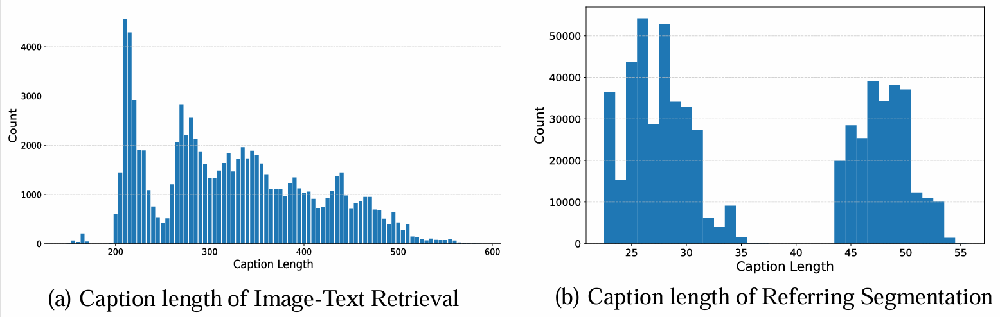
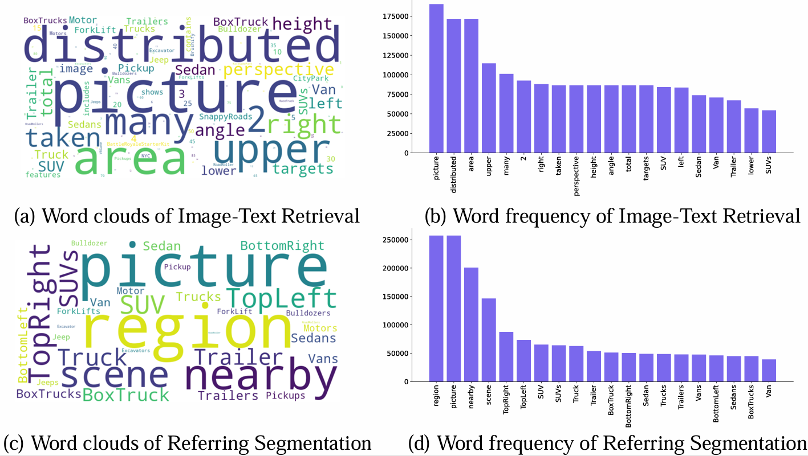
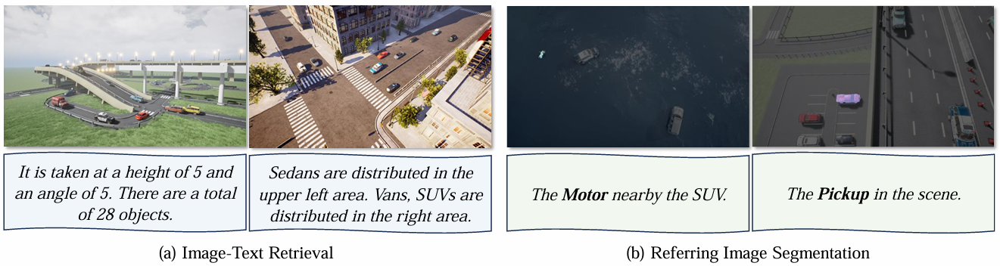
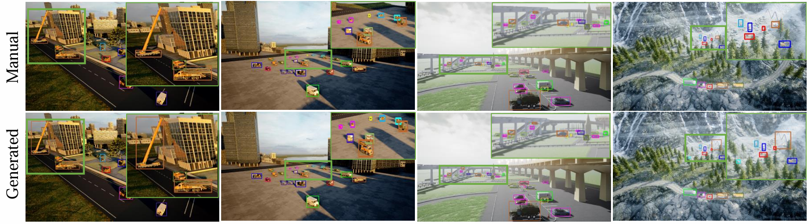

# Supplementary materials

## 📋 Table of Contents

1. [More Statistics of UEMM-Air](#more-statistics-of-uemm-air)  
   1.1 [Distribution and word clouds of captions](#distribution-and-word-clouds-of-captions)  
   1.2 [Visualizations of Cross-modality Generation](#visualizations-of-cross-modality-generation)  
   1.3 [Comparison with Manual Annotations](#comparison-with-manual-annotations)  
   1.4 [Detail Experiments](#detail-experiments)  

2. [Acquisition Setup](#acquisition-setup)   

3. [Related Works](#related-works)  
   3.1 [UAV-based Environmental Perception](#uav-based-environmental-perception)
   3.2 [UAV-based Environmental Perception Datasets](#uav-based-environmental-perception-datasets)  
 

## More Statistics of UEMM-Air

### Distribution and word clouds of captions
We generated 7 distinct captions for each image, resulting in a total of 840,000 descriptions. 
We present a visualization of the caption length distribution for our final data.

It can be observed that the caption length distribution shows a peak around 200, with most lengths concentrated between 200-400. 
Beyond 400, the frequency decreases, forming a long-tail pattern.
We also provide visualizations of word clouds and the top 20 keywords of our UEMM-Air. The words exclude stop words like "the", "is", and others.

### Visualizations of Cross-modality Generation
To validate the accuracy of the generated captions, we randomly selected samples for visualization. 
As shown in Fig, the captions for the image-text retrieval task accurately describe the number and spatial relationships of the objects, as well as the UAV's height and angle information. 
The captions for the referring image segmentation specifically describe the location of a particular object and successfully generate the mask for the object.

### Comparison with Manual Annotations
We randomly selected a subset of images for manual annotation and then visually compared them with our automatic annotations. 

As presented in Fig, we visualized our generated labels and manually annotated labels separately for comparison. It can be observed that our annotations are almost identical in position to the manual labels.
Moreover, our annotation algorithm has some advantages in labeling small objects. We found that when objects are far away, manual annotations may contain errors due to the smaller scale of the objects. For example, manual annotations may not be as closely aligned with the edges of the objects as our generated annotations. It will introduce more foreground information, which could impact the model's accuracy

### Detail Experiments
**Table: Referring image segmentation performance on UEMM-Air.**

| Methods         | Publication | Image Backbone | Text Backbone | Pr@0.5  | Pr@0.6  | Pr@0.7  | Pr@0.8  | Pr@0.9 | oIoU   | mIoU   |
| :-------------- | :---------- | :------------- | :------------ | :------ | :------ | :------ | :------ | :----- | :----- | :----- |
| LAVT            | CVPR22      | Swin-B         | BERT          | 53.17%  | 42.42%  | 35.47%  | 23.69%  | 8.03%  | 63.72% | 51.09% |
| RMSIN       | CVPR24  | Swin-B         | BERT          | **57.40%** | **49.20%** | **38.80%** | 25.40%  | 8.60%  | **65.82%** | **51.97%** |
| RefSegformer    | IEEE TIP24  | Swin-B         | BERT          | 55.28%  | 48.55%  | 38.01%  | **26.04%** | **8.62%** | 64.99% | 51.23% |

## Acquisition Setup

<em>RGB Camera</em>: Offers a resolution of 1920 × 1080 pixels. The vertical field of view (FoV) increases dynamically from 0° to 90°, indicating that the viewing angle changes from horizontal to top-down. All RGB images are stored in PNG format.

RGB images contain rich color, and spatial information, facilitating better image understanding and object recognition. 
The visual image is the most common modality in computer vision tasks. However, in complex environments such as nighttime, visual images alone may not perform well due to the poor visibility and the resulting inability to effectively detect objects.

<em>Depth Camera</em>: Has the same FoV, resolution and storage format as the RGB camera. Interpolates each pixel value from 0 to 255 according to distance from the camera plane. White pixels show depths >100 meters, black pixels indicate 0 meters.

Depth images leverage pixels to represent the distance from the object to the camera, reflecting the spatial shape and structure of the photographed scene. Therefore, we utilize it to address the issue of inaccurate annotations caused by overlapped visual information of the objects during the annotation generation process.
It can also be leveraged to deduce an object's height, convexity, and relative position, which aids in multi-modal object objection.

<em>Segmentation Camera</em>: Maintains identical FoV, resolution, and data format. Generates distinct colors for pixels belonging to different object categories to ensure accurate scene segmentation.

The segmentation image divides the image into multiple regions with similar attributes, providing pixel-level information where each pixel is assigned to a precise category label. Because of the detailed segmentation information, this modality can assist in the automatic generation of detection annotations. Additionally, since segmentation images inherently contain positional information, combining them with other modalities for detection often leads to improved accuracy. 

<em>Surface Normal Camera</em>: Maps X, Y, Z components of surface normals to RGB (0-255). Due to gradual directional changes, images use 1.5× contrast enhancement for clearer delineation. Saves PNGs with same FoV/resolution as Scene Camera.

Surface normal images primarily capture the geometric features and surface details of the target object. When fused with RGB images or other modalities, they can compensate for deficiencies in texture features. For example, in fine-grained object detection, the texture features introduced by the surface normal modality can help the model learn deeper fine-grained information. Additionally, it reveals intricate surface details essential for generating precise 3D reconstruction surface models.

<em>IMU Parameters</em>: Include dynamic state data, GPS information, flying altitude and timestamps. Dynamic state parameters consist of:  
- Attitude angle  
- Linear velocity  
- Body angular velocity  
- Linear acceleration  
- Collective angular acceleration

IMU parameters comprise real-time attitude details and UAV position coordinates. In multimodal tasks, the current flying altitude of the UAV can be utilized to assist in determining the scale information of the object. For example, the current frame's flight posture is beneficial for the model to predict the next frame's object location, especially in tasks like video object detection or object tracking. Additionally, the UAV's GPS information can also be employed for post-detection localization tasks.

## Related Works

### UAV-based Environmental Perception
UAV-based environmental perception primarily involves two tasks: object detection and semantic segmentation.

#### Object Detection
Due to the typically top-down perspective of UAVs and relatively small object scales, general object detection methods are generally unsuitable for UAV-based Object Detection (UAV-OD) tasks. Mainstream approaches primarily employ coarse-to-fine strategies where initial detection focuses on larger objects while simultaneously pinpointing dense subregions containing small objects, which are then used as refined inputs for subsequent detection stages. For example, CZDetector utilizes density-based cropping to identify crowded object regions and expands these areas to enhance training data, while other approaches employ Gaussian mixture models to supervise detectors in generating object clusters. To address limited computing resources, accuracy-efficiency balancing methods include CEASC's plug-and-play detection with enhanced sparse convolution and adaptive masking, along with SIFDAL's approach of disentangling scale-invariant features to boost accuracy while reducing inference costs. Additionally, for low-computation UAV environments, compression techniques like pruning and distillation are commonly employed alongside domain adaptation approaches to optimize performance on edge devices. 

#### Semantic Segmentation
Similar to object detection, specialized semantic segmentation methods have been developed for UAV scenarios, with high-resolution representation learning being particularly crucial due to ultra-high image resolutions and varying object scales in remote sensing imagery. Example approaches include HRNet, which exchanges semantic information across multi-resolution sub-networks, and SGBNet that employs Semantics Guided Bottleneck with Channel Pooled Attention to balance segmentation accuracy, model size, and inference speed. Concurrently, various lightweight methods address real-time application requirements through model optimization specifically designed for UAV platforms, incorporating efficiency-focused architectures and hardware-aware design principles to meet operational constraints while maintaining performance standards.

### UAV-based Environmental Perception Datasets

Commonly used UAV datasets advancing computer vision tasks (object detection, tracking, scene understanding):

####  Object Detection Datasets
- **Stanford-Drone**: Large-scale overhead imagery of multi-class object interactions at Stanford University. Supports multi-object tracking and trajectory prediction.
- **UAVDT**: 80,000 frames with bounding boxes + 14 attributes across complex scenarios. Focuses on detection and tracking tasks.
- **VisDrone**: Large-scale benchmark with 2.5M+ bounding boxes across 10 object categories under diverse conditions.
- **AU-AIR**: Contains traffic object annotations + multi-modal flight sensor data captured at low-altitude intersections.
- **Drone-Vehicle**: RGB-Infrared cross-modality vehicle detection covering day/night transitions at multiple angles/heights.
- **HIT-UAV**: First public high-altitude infrared thermal dataset with oriented/standard bounding boxes for overlapping objects.
- **RTDOD**: First RGB-Thermal domain-incremental dataset covering weather/day-night transitions.
- **State-Air**: Real-world multi-modal dataset with 2,862 images (sunny/snowy) across 4 categories.

#### Semantic Segmentation Datasets
- **UAVid**: Complex urban scenes with 300 high-res oblique images (8 classes) for static/moving object recognition.
- **NWPU_YRCC**: First public river ice segmentation dataset (814 images) from varying heights/periods.
- **RescueNet**: High-res post-disaster dataset for damage assessment (building classification, road segmentation).
- **AFID**: Aerial/fluvial images for hydrologic data collection and environmental inspection.
- **SkyScenes**: Synthetic dataset (33.6K images) with pixel-level semantic/instance/depth annotations from multiple altitudes.
- **SynDrone**: Multi-modal synthetic benchmark with 28-class pixel/object annotations for segmentation/detection.